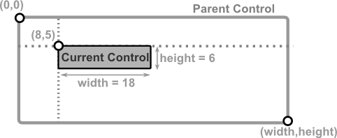

# Absolute position

This layout mode positions a control using absolute coordinates relative to its parent container.

**Required parameters**
- `x` and `y` must be provided and represent the **top-left** corner of the control.

**Optional parameters**
- `width` and `height` can be provided to set the control's size. If not provided, they default to **1 character** (unless a minimum width or height is enforced by the control).

To create a control using this mode, you can use the following syntax:
* `Layout::absolute(...)` - requires all four parameters (does not support percentages).
* `LayoutBuilder` - and you will need to use the `x(...)`, `y(...)` and optionall `width(...)` and `height(...)` methods.
* `layout!` procmacro - and you will need to provide the `x`, `y` and optionally `width` and `height` parameters.

**Remarks**:
- using `Layout::absolute(...)` does not support percentages for any parameter (if these are needed, consider using `LayoutBuilder` or `layout!` procmacro)
- Negative values for `x` and `y` are allowed and will position the control outside the parent.

## Visual representation

Below is an example where a control is positioned with its top-left corner at coordinates `(8, 5)` and a size of `18×6` characters.


<table>
<tr>
<td style="width:45%; vertical-align:top;">


```rs
Layout::absolute(8,5,18,6)
```
or
```rs
LayoutBuilder::new().x(8)
                    .y(5)
                    .width(18)
                    .height(6)
                    .build()
```
or
```
layout!("x:8,y:5,w:18,h:6")
```

</td>

<td style="width:55%; vertical-align:center;">




</td>

</tr>
</table>


## Examples

1. Control positioned at `(8, 5)`, size `30×6`
    ```rs
    // using Layout class
    Layout::absolute(8, 5, 30, 6)
    // or using a LayoutBuilder:
    LayoutBuilder::new().x(8).y(5).width(30).height(6).build()
    // or using macro (with full-name parameters):
    layout!("x:8,y:5,width:30,height:6")
    // or using macro (with aliases):
    layout!("x:8,y:5,w:30,h:6")
    ```
2. Control at `(4, 3)`, width = `50%` of parent, height = `10`
    ```rs
    // using a LayoutBuilder:
    LayoutBuilder::new().x(4).y(3).width(0.5).height(10).build()
    // or using macro (with full-name parameters):
    layout!("x:4,y:3,width:50%,height:10")
    // or using macro (with aliases)
    layout!("x:4,y:3,w:50%,h:10")
    ```    


3. Control positioned at `(25%, 50%)` with height = `8` and the **default width**.
    ```rs
    // using a LayoutBuilder:
    LayoutBuilder::new().x(0.25).y(0.5).height(8).build()
    // or using macro (with full-name parameters):
    layout!("x:25%,y:50%,height:8")
    // or using macro (with aliases)
    layout!("x:25%,y:50%,h:8")
    ```
